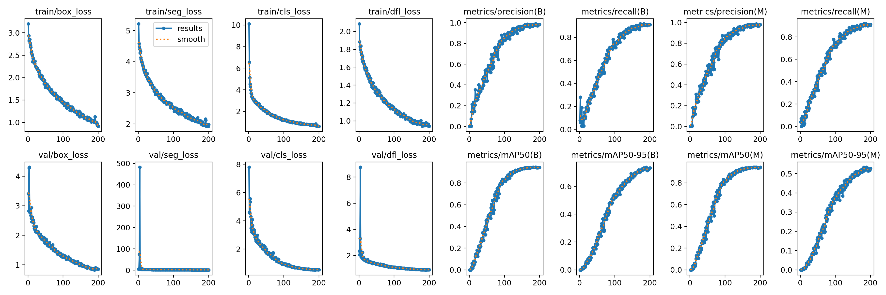

# Dental Anomaly Detection using YOLOv8 Object Detection and Segmentation

This project leverages the **Tufts Dental Database: A Multimodal Panoramic X-Ray Dataset** to detect dental anomalies such as missing teeth, implants, and lesions. Using a multi-step pipeline based on YOLOv8 object detection and segmentation, we demonstrate state-of-the-art performance, surpassing reported results in the original Tufts paper in both detection and segmentation tasks.

---

## 📦 Dataset

**Source**: [Tufts Dental Database](https://arxiv.org/abs/2312.06226)

**Highlights**:
- High-resolution panoramic dental X-ray images
- Expert-labeled annotations for dental anomalies
- YOLO format for bounding boxes and polygons for segmentation
- Below is the bounding box class distribution in our preprocessed dataset:

---

## 📚 Project Overview

Our pipeline involves four sequential processing steps:

1. **Maxillomandibular Region Detection**  
   Isolating the region of interest in the panoramic scan.  
   

2. **Tooth Segmentation**  
   Extracting the tooth structures from the X-ray for individual inspection.  
   

3. **Anomaly Detection**  
   Identifying and segmenting anomalies within the detected teeth regions.  
   

---

## 🧠 Model Pipeline

| Stage               | Model     | Description                                  |
|---------------------|-----------|----------------------------------------------|
| Region Detection    | YOLOv8    | Localizes the maxillomandibular structure    |
| Tooth Segmentation  | YOLOv8-seg| Extracts teeth using fine-grained masks      |
| Anomaly Segmentation| YOLOv8-seg| Detects and outlines dental anomalies        |

---

## 🏋️‍♂️ Training Setup

- **Model**: YOLOv8 (Object Detection + Segmentation)
- **Epochs**: 200
- **Loss Types**: Classification, Box, Segmentation, DFL
- **Optimization**: AdamW optimizer with cosine annealing scheduler

Training and validation loss convergence:

---

## 📊 Performance Metrics

| Metric               | Our Model  | Tufts Paper (Benchmark) |
|----------------------|------------|--------------------------|
| mAP@0.5 (Detection)  | **0.946**  | ~0.82 (YOLOv5s)          |
| mAP@0.5 (Segmentation)| **0.942** | ~0.84 (ResNet-FCN)       |
| Max F1 Score         | 0.95       | N/A                      |
| Max Precision        | 1.00       | N/A                      |
| Max Recall           | 0.95       | N/A                      |

> 🔍 Our model outperforms both the YOLOv5s and FCN baselines reported in the Tufts paper.

---

## 📈 Detection & Segmentation Curves

### Bounding Box Metrics
- F1 vs Confidence: 
- Precision vs Confidence: 
- PR Curve: 
- Recall vs Confidence: 

### Segmentation Metrics
- F1 vs Confidence: 
- Precision vs Confidence: 
- PR Curve: 
- Recall vs Confidence: 

---

## 📊 Confusion Matrices

- Raw: 
- Normalized: 

> ✅ 93% of anomalies were detected correctly with minimal misclassification.

---

## 📷 Sample Outputs

### Ground Truth (Train)

### Ground Truth vs Predictions (Validation)
- Labels: 
- Predictions: 

---

## 💡 Key Takeaways

- Strong generalization across both detection and segmentation tasks.
- Our YOLOv8-based model achieves higher mAP than Tufts’ original baselines.
- Expert visualizations enhance interpretability (e.g., gaze heatmaps).
- Overlay-based masks (teeth, anomalies, jaw) help debug predictions effectively.

---

## 🔮 Future Work

- Expand to multi-class anomaly types.
- Leverage time-series dental imaging for disease progression tracking.
- Integrate with 3D dental modeling platforms.

---

## 🛠️ Tools & Frameworks

- **YOLOv8 (Ultralytics)** – Detection & Segmentation
- **OpenCV + Matplotlib** – Visualization
- **NumPy + Pandas** – Analysis & Aggregation
- **Tufts Dental Dataset** – Panoramic X-ray Images

---

## 📌 Conclusion

This work showcases the capability of YOLOv8 to outperform existing academic models on the Tufts Dental Dataset. By leveraging expert insights, region-wise segmentation, and careful visualization, we not only improve accuracy but also provide a robust diagnostic tool for dental practitioners.
